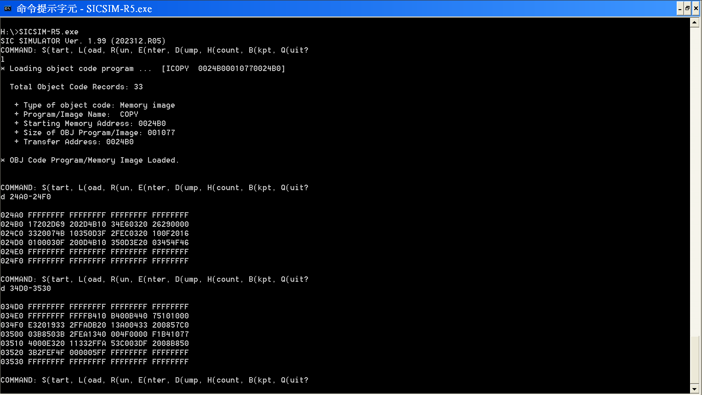
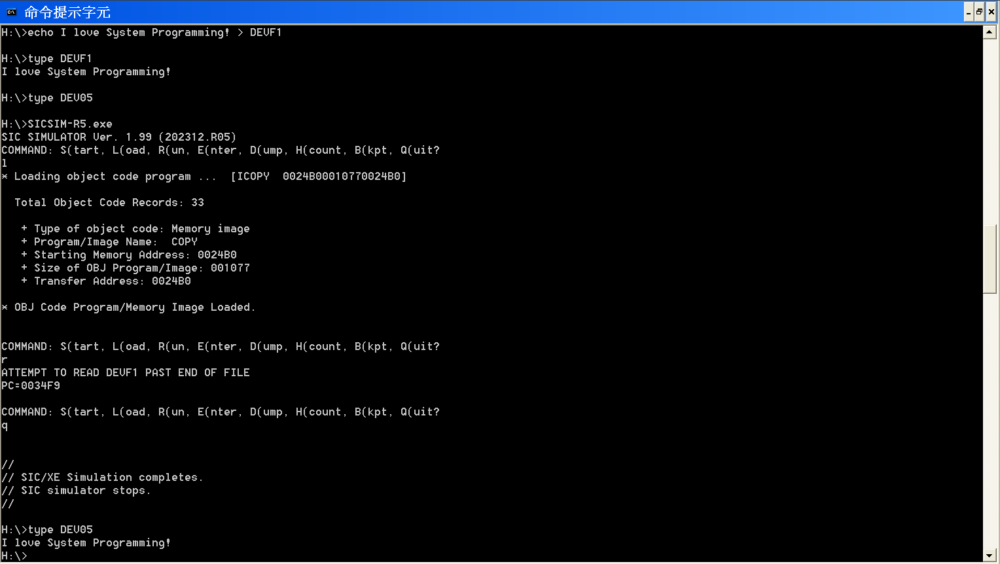

# 2023_system_programming_hw3_in_ncku
This is the README file for the hw3 of the system programming courses in 2023, NCKU ---- an SIC/XE relocation loader.

This file is meant to demonstrate how the program `main.c` does and how to use it.

## Prerequisites
Please ensure that you have `gcc` installed on you computer to compile this.

Consequence of usage of any other c compiler is unknown.

Also, notice that this file is developed on Ubuntu 20.04.

## Get started
One can simply run

```bash
$ gcc main.c
```

to compile the file.

## Usage
To use it, please prepare the input SIC/XE object file first.

An input example is given as `input.txt` file.

Run

```bash
$ ./a.out < ${input file path} > ${output file path (optional)}
```

to generate the corresponding memory image file based on random starting addresses.

For example,

```bash
$ ./a.out < input.txt > output.txt
```

This will read in the object code and relocate it into random one of the pages starting between 0x1230 ~ 0x6000.

The default page size used here is 64 bytes.

You can change all of the setting in the macro of `main.c`.

As for the `output.txt` example, one can load it into the memory with an SIC/XE simulator as shown in the following picture:



Moreover, one can run it:



It will copy the content of `DEVF1` file and paste it to the `DEV05` file just as what it was designed for.

**NOTE: Altough the code is original, this `input.txt` example is from the page 65 of the book *System Software: An Introduction to Systems Programming, 3/e* by Leland L. Beck. It's not mine and used here only for demonstration.**
